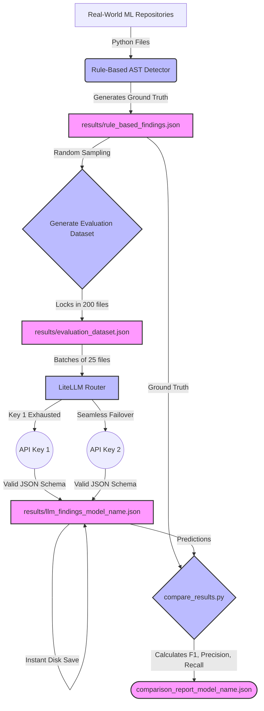

# AlgoDebt: Algorithm Debt Detection Pipeline

This repository contains the evaluation pipeline for our research on detecting **Algorithm Debt** in Machine Learning code. We are comparing the effectiveness of traditional **Rule-Based (AST) Detection** against modern **Large Language Models (LLMs)** to identify harmful shortcuts taken by ML engineers.

---

## 🧠 What is Algorithm Debt?

Algorithm Debt refers to poor coding practices in ML systems that might work in the short term but cause significant maintenance, reproducibility, or accuracy issues in the long term. 

We specifically hunt for 5 anti-patterns:
1. **Hardcoded Hyperparameters:** (e.g., `lr=0.01` hardcoded instead of configured).
2. **Missing Data Validation:** Training models on tabular data without checking for missing/NaN values first.
3. **Train/Test Leakage:** Fitting scalers or transformers on the *entire* dataset before splitting it.
4. **No Reproducibility Control:** Failing to set random seeds (e.g., `np.random.seed()`) before training.
5. **Silent Exception Handling:** Using `except: pass` which silently swallows critical errors.

---

## 🏗️ Architecture & Pipeline (Built for Academic Rigor)

To process massive datasets on free-tier APIs without hitting limits or corrupting data, we use a robust pipeline featuring **Key-Pooling**, **Strict JSON Schema Enforcement**, and **Instant Checkpointing**.

### 1. Key-Pool Routing (Bypassing Rate Limits)
The `litellm.Router` acts as a load balancer. By placing multiple numbered API keys in the `.env` file (e.g., `GEMINI_API_KEY_1`, `GEMINI_API_KEY_2`), the router instantly swaps keys the millisecond one hits its daily quota.

### 2. Resumable Checkpointing
The script writes results to disk immediately after every batch. If you run out of all keys or the script crashes, you lose no data. The script will automatically skip graded files on the next run.

### 3. Strict JSON Schema (Preventing Truncation)
Instead of relying on prompt engineering, we pass a strict `response_format` to the LLM to force structural JSON output. This allows us to use massive batch sizes (up to 25 files at once) without the LLM getting lazy and truncating the output.



---

## 🚀 Setup Instructions

1. **Create and activate the virtual environment:**
   ```powershell
   python -m venv venv
   .\venv\Scripts\activate
   ```

2. **Install dependencies:**
   ```powershell
   pip install -r requirements.txt
   ```

3. **Configure API Keys:**
   Create a `.env` file in the root directory and add multiple keys for automatic rotation:
   ```env
   GROQ_API_KEY_1=your_key
   GROQ_API_KEY_2=your_key
   GEMINI_API_KEY_1=your_key
   GEMINI_API_KEY_2=your_key
   COHERE_API_KEY=your_key
   MISTRAL_API_KEY=your_key
   ```
