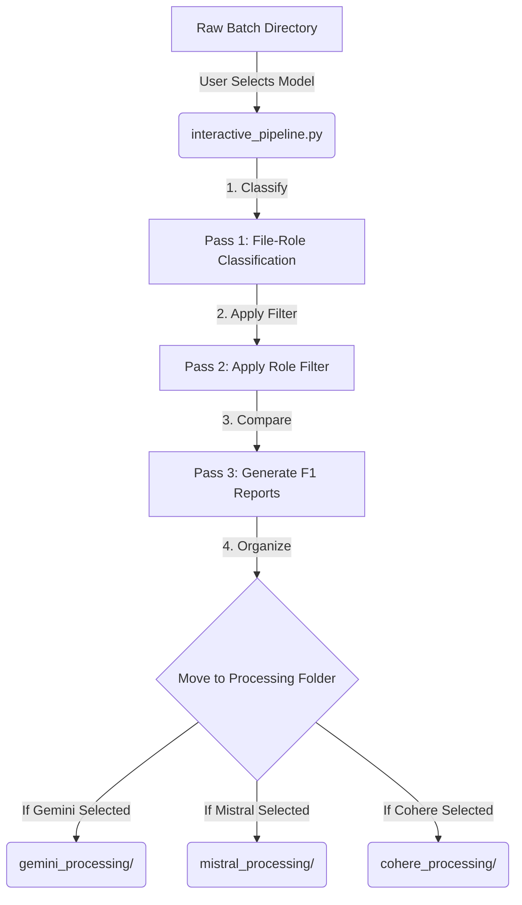
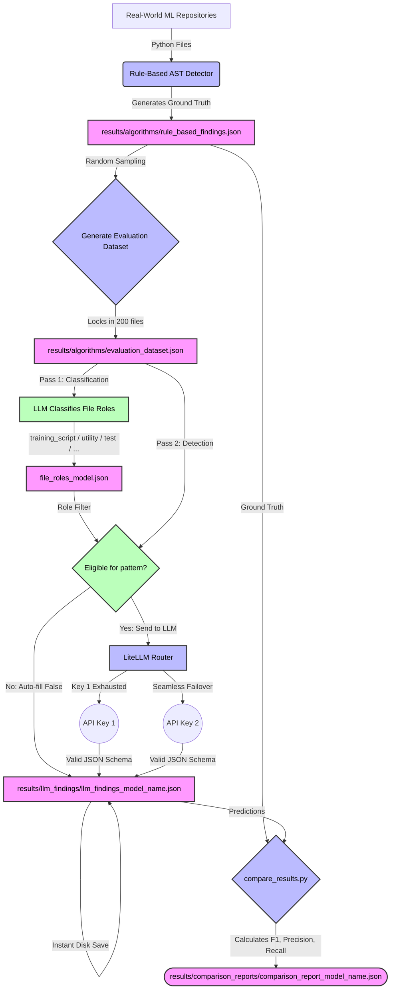

# AlgoDebt: Algorithm Debt Detection Pipeline

This repository contains the evaluation pipeline for our research on detecting **Algorithm Debt** in Machine Learning code. We are comparing the effectiveness of traditional **Rule-Based (AST) Detection** against modern **Large Language Models (LLMs)** to identify harmful shortcuts taken by ML engineers.

---

## What is Algorithm Debt?

Algorithm Debt refers to poor coding practices in ML systems that might work in the short term but cause significant maintenance, reproducibility, or accuracy issues in the long term. 

We specifically hunt for 5 anti-patterns:
1. **Hardcoded Hyperparameters:** (e.g., `lr=0.01` hardcoded instead of configured).
2. **Missing Data Validation:** Training models on tabular data without checking for missing/NaN values first.
3. **Train/Test Leakage:** Fitting scalers or transformers on the *entire* dataset before splitting it.
4. **No Reproducibility Control:** Failing to set random seeds (e.g., `np.random.seed()`) before training.
5. **Silent Exception Handling:** Using `except: pass` which silently swallows critical errors.

---

## Architecture & Pipeline

To process massive datasets on free-tier APIs without hitting limits or corrupting data, we use a robust pipeline featuring **Key-Pooling**, **Strict JSON Schema Enforcement**, **Instant Checkpointing**, and a **Two-Pass Classification Architecture**.

### 1. Two-Pass Classification Architecture (Pre-Filter)
The primary failure mode of zero-shot LLMs is context deprivation (e.g., incorrectly flagging a utility script for missing data validation). To resolve this, our pipeline enforces a two-pass system:
- **Pass 1:** The LLM classifies the file's role (e.g., `training_script`, `utility`, `test`).
- **Pass 2:** Existing raw detection flags are filtered against an eligibility matrix. Ineligible flags are automatically reversed.

### 2. Interactive Pipeline Manager
To facilitate comparative research, we designed an interactive CLI (`scripts/interactive_pipeline.py`) that fully automates the classification and filtering workflows. It executes the file classification using a user-selected model, automatically filters all findings, generates updated comparison reports, and cleanly packages the results into distinct execution folders.



### 3. Key-Pool Routing (Bypassing Rate Limits)
The `litellm.Router` acts as a load balancer. By placing multiple numbered API keys in the `.env` file (e.g., `GEMINI_API_KEY_1`, `GEMINI_API_KEY_2`), the router instantly swaps keys the millisecond one hits its daily quota.

### 4. Resumable Checkpointing
The script writes results to disk immediately after every batch. If you run out of all keys or the script crashes, you lose no data. The script will automatically skip graded files on the next run.

### 5. Strict JSON Schema (Preventing Truncation)
Instead of relying on prompt engineering, we pass a strict `response_format` to the LLM to force structural JSON output. This allows us to use massive batch sizes (up to 25 files at once) without the LLM getting lazy and truncating the output.



---

## Setup Instructions

1. **Create and activate the virtual environment:**
   ```powershell
   python -m venv venv
   .\venv\Scripts\activate
   ```

2. **Install dependencies:**
   ```powershell
   pip install -r requirements.txt
   ```

3. **Configure API Keys:**
   Create a `.env` file in the root directory and add multiple keys for automatic rotation:
   ```env
   GROQ_API_KEY_1=your_key
   GROQ_API_KEY_2=your_key
   GEMINI_API_KEY_1=your_key
   GEMINI_API_KEY_2=your_key
   COHERE_API_KEY=your_key
   MISTRAL_API_KEY=your_key
   ```

> 📖 **For the complete step-by-step walkthrough** (including all pipeline stages, troubleshooting, and expected outputs), see **[HOW_TO_RUN.md](HOW_TO_RUN.md)**.

---

## Results Summary

We evaluated **4 LLMs** against the rule-based AST baseline across a locked dataset of **200 Python files** from **28 real-world GitHub repositories**.

### F1 Score Comparison

| Model | Hardcoded Params | Missing Validation | Leakage | No Reproducibility | Silent Exceptions |
|---|---|---|---|---|---|
| **Gemini 3.5 Flash** | 0.24 | **0.77** | **0.86** | **0.32** | **0.52** |
| **Mistral Large** | 0.04 | 0.00 | 0.00 | 0.00 | 0.00 |
| **Cohere Command R+** | 0.47 | 0.11 | 0.22 | 0.12 | 0.08 |
| **Llama 3.3 70B (Groq)** | **0.66** | 0.07 | 0.18 | 0.28 | **0.52** |

### Key Findings

- **LLMs excel at syntactically local anti-patterns** — hardcoded hyperparameters and silent exception handling have clear, self-contained signatures (a literal value or a bare `except` block) that LLMs detect well.
- **LLMs fail at structural anti-patterns** — missing data validation and no reproducibility control require understanding a file's *role* in the ML pipeline (e.g., training script vs. utility helper). Without this context, LLMs massively over-flag, producing hundreds of false positives.
- **Gemini 3.5 Flash is the exception** — it significantly outperforms all other models on structural patterns, suggesting better internal reasoning about file relevance.
- **Mistral Large completely failed** — it hallucinated anti-patterns across nearly every file, producing near-zero precision and F1 on all categories.

> For detailed per-model analysis with confusion matrices, see **[Analysis.md](Analysis.md)**.

---

## Limitations

### 1. Rule-Based Ground Truth is Heuristic, Not Perfect
The AST-based detector serves as the ground truth baseline, but it is itself a heuristic. Some of the LLM's "false positives" may actually be legitimate detections that the rule-based tool missed (e.g., the LLM recognizing a subtle form of hardcoded hyperparameter that doesn't match the keyword list). The rule-based detector was validated on synthetic test cases, but not exhaustively verified across all 1,619 files.

### 2. Line-Number Ordering for Leakage Detection
The train/test leakage detector compares raw line numbers (`fit()` appearing before `train_test_split()`). This works well for linear, notebook-style scripts but can produce false positives in modular code where a function *definition* containing `fit()` appears at the top of the file but is *called* after the split.

### 3. Single-File Isolation (No Cross-File Analysis)
Every file is analyzed independently. If `utils.py` sets a random seed and `train.py` imports from it, the detector will still flag `train.py` for "no reproducibility control" because it cannot reason across files.

### 4. Limited Hyperparameter Vocabulary
The `HYPERPARAM_NAMES` set covers common names (`lr`, `batch_size`, `epochs`, etc.) but misses less common ones like `gamma`, `alpha`, `num_heads`, `embed_dim`, or `warmup_steps`. This is an inherent limitation of keyword-matching approaches.

### 5. Python-Only, No Jupyter Notebook Support
The pipeline processes only `.py` files. A significant amount of real-world ML algorithm debt lives in Jupyter notebooks (`.ipynb`), which are excluded from analysis.

### 6. Evaluation Sample Size
The evaluation dataset consists of 200 files. While stratified to ensure positive/negative representation, rare anti-patterns like train/test leakage (0.2% base rate) may have insufficient samples for statistically robust conclusions.

### 7. Single Prompting Strategy
All LLMs were evaluated using a single zero-shot system prompt with `temperature=0`. No chain-of-thought reasoning, few-shot examples, or fine-tuning were applied. Performance may improve significantly with more sophisticated prompting techniques.

---

## Future Scope

### 1. File-Role Classification Pre-Filter (Implemented)
A two-pass LLM architecture that first classifies each file's role (e.g., *training script*, *model architecture*, *utility/helper*, *test file*, *config*) before checking for anti-patterns. Only patterns relevant to the file's role are checked — for example, `missing_data_validation` is only checked on training scripts and data pipelines, not on utility files or tests. This eliminates the primary source of false positives observed across all models.

**How it works:**
1. **Pass 1 (`--classify`):** The LLM classifies each file into one of 6 roles. Results are saved to `file_roles_{model}.json`.
2. **Role Filter (`apply_role_filter.py`):** Each file's anti-pattern flags are filtered through an eligibility matrix — ineligible patterns are forced to `False`.
3. **Pass 2 (Comparison):** `compare_results.py --suffix _role_filtered` generates separate comparison reports so you can see the before/after improvement.

| Role | Hardcoded HP | Missing Validation | Leakage | No Reproducibility | Silent Exceptions |
|---|---|---|---|---|---|
| `training_script` | ✅ | ✅ | ✅ | ✅ | ✅ |
| `data_pipeline` | ❌ | ✅ | ✅ | ❌ | ✅ |
| `model_architecture` | ✅ | ❌ | ❌ | ❌ | ✅ |
| `utility` | ❌ | ❌ | ❌ | ❌ | ✅ |
| `test` / `config` | ❌ | ❌ | ❌ | ❌ | ❌ |

### 2. Multi-Model Ensemble Approach (Proposed for Production)
Based on our cross-batch findings, the ultimate production pipeline for Algorithm Debt is an **Ensemble Model**. We propose using a highly capable LLM (Llama 3.3 / Groq) for high-recall syntactic checks (hardcoded values, exceptions) combined with a structurally dominant model (Gemini 3.5 Flash) for leakage and validation checks. All of this must be gated behind a Gemini-powered File-Role classification pass to eliminate context-deprived false positives.

### 3. Few-Shot and Chain-of-Thought Prompting
Evaluate whether providing 2–3 annotated examples in the prompt (few-shot) or asking the LLM to reason step-by-step (chain-of-thought) before making a classification significantly reduces false positives on structural anti-patterns.

### 4. Fine-Tuned Models
Train a lightweight, task-specific model (e.g., fine-tuned CodeLlama or StarCoder) on the labeled ground truth dataset. This would combine the LLM's contextual understanding with domain-specific precision.

### 5. Jupyter Notebook Support
Add an `nbconvert` preprocessing step to extract Python code from `.ipynb` files before analysis. Notebooks are a primary source of ML algorithm debt in practice.

### 6. Cross-File / Repository-Level Analysis
Extend the rule-based detector to reason across files within a repository. For example, check if a random seed is set *anywhere* in the project (e.g., in `main.py` or `config.py`) before flagging individual training scripts for missing reproducibility control.

### 7. Expanded Anti-Pattern Taxonomy
Add additional algorithm debt categories from the taxonomy by Suominen & Hettiarachchi et al. [2], such as:
- **Undocumented model assumptions** (training on specific data distributions without documentation)
- **Feature engineering debt** (manual feature transformations that should be automated)
- **Evaluation debt** (training without proper cross-validation or holdout sets)

### 8. Longitudinal Study
Track how algorithm debt evolves over time within repositories by analyzing multiple commits/versions, measuring whether debt accumulates, gets repaid, or migrates between anti-pattern categories.

### 9. IDE Plugin
Package the rule-based detector as a VS Code / PyCharm extension that provides real-time algorithm debt warnings as developers write ML code — similar to how ESLint works for JavaScript.

---

## Project Structure

```
AlgoDebt/
├── Content/                          # IEEE paper + structured extracts
│   ├── algorithm_debt_paper_IEEE.pdf # The research paper
│   ├── algorithm_debt_paper_IEEE.md  # Grounded markdown version
│   ├── algorithm_debt_paper_IEEE.docx
│   ├── algorithm_debt_paper_IEEE_grounded.json
│   ├── algorithm_debt_paper_IEEE_summary.json
│   └── tables/                       # Extracted tables (CSV + HTML)
├── scripts/
│   ├── fetch_repos.py                # Clone ML repos from GitHub
│   ├── rule_based_detector.py        # AST-based anti-pattern detector
│   ├── run_baseline.py               # Run detector across all repos
│   ├── llm_detector.py               # LLM evaluation with key pooling + file classification
│   ├── compare_results.py            # Precision / Recall / F1 calculator
│   ├── apply_role_filter.py          # Apply role-based filtering to existing findings
│   ├── archive_batch.py              # Archive completed batch to results/archive/
│   └── interactive_pipeline.py       # Interactive CLI for multi-model processing
├── repos/                            # Cloned repositories (git-ignored)
├── results/
│   ├── algorithms/                   # Ground truth + evaluation dataset
│   ├── archive/                      # Completed batch archives
│   │   └── batch_N/                  # Each batch's dataset + results
│   ├── llm_findings/                 # Active batch LLM outputs
│   └── comparison_reports/           # Active batch confusion matrices
├── Analysis.md                       # Detailed results analysis
├── API Limits.md                     # Free-tier rate limits per provider
├── HOW_TO_RUN.md                     # Complete setup & run guide
├── README.md                         # ← You are here
├── commands.md                       # Quick command reference
├── requirements.txt                  # Python dependencies
└── .env                              # API keys (git-ignored)
```

---

## Citation

If you use this pipeline or dataset in your research, please cite:

```bibtex
@inproceedings{algodebt2026,
  title     = {Can General-Purpose Large Language Models Detect Algorithm Debt 
               in Machine Learning Code? A Comparative Study Against Rule-Based Detection},
  author    = {Department of Computer Science and Information Technology},
  booktitle = {IEEE Conference Proceedings},
  year      = {2026},
  institution = {NED University of Engineering and Technology, Karachi, Pakistan}
}
```

---

*Built at NED University of Engineering and Technology, Karachi, Pakistan.*
