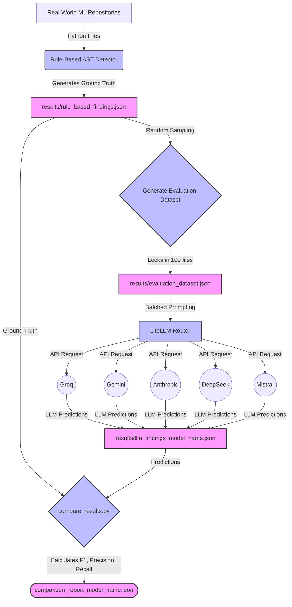

# AlgoDebt: Algorithm Debt Detection Pipeline

This repository contains the evaluation pipeline for our research on detecting **Algorithm Debt** in Machine Learning code. We are comparing the effectiveness of traditional **Rule-Based (AST) Detection** against modern **Large Language Models (LLMs)** to identify harmful shortcuts taken by ML engineers.

---

## 🧠 What is Algorithm Debt?

Algorithm Debt refers to poor coding practices in ML systems that might work in the short term but cause significant maintenance, reproducibility, or accuracy issues in the long term. 

We specifically hunt for 5 anti-patterns:
1. **Hardcoded Hyperparameters:** (e.g., `lr=0.01` hardcoded instead of configured).
2. **Missing Data Validation:** Training models on tabular data without checking for missing/NaN values first.
3. **Train/Test Leakage:** Fitting scalers or transformers on the *entire* dataset before splitting it.
4. **No Reproducibility Control:** Failing to set random seeds (e.g., `np.random.seed()`) before training.
5. **Silent Exception Handling:** Using `except: pass` which silently swallows critical errors.

---

## 🏗️ Architecture & Pipeline

Our pipeline pits a Rule-Based Baseline against various LLMs. Here is how the evaluation workflow operates:



---

## 🚀 Setup Instructions

1. **Create and activate the virtual environment:**
   ```powershell
   python -m venv venv
   .\venv\Scripts\activate
   ```

2. **Install dependencies:**
   ```powershell
   pip install -r requirements.txt
   ```

3. **Configure API Keys:**
   Create a `.env` file in the root directory and add your API keys:
   ```env
   GROQ_API_KEY=your_key
   GEMINI_API_KEY=your_key
   ANTHROPIC_API_KEY=your_key
   DEEPSEEK_API_KEY=your_key
   MISTRAL_API_KEY=your_key
   ```

---

## ⚙️ Usage Guide

### Step 1: Generate the Test Dataset (Run Once)
To ensure a fair comparison, all models must be tested on the exact same files.
```powershell
python scripts/llm_detector.py --sample 100 --generate-dataset
```

### Step 2: Run the LLM Detector
We use `litellm` to route requests, meaning you can test almost any model just by changing the `--model` flag.

* **For APIs with strict Rate Limits (e.g., Groq):** Process 1 file at a time with a delay.
  ```powershell
  python scripts/llm_detector.py --model groq/llama-3.3-70b-versatile --batch-size 1 --delay 3
  ```

* **For APIs with high limits (e.g., Gemini, Anthropic):** Batch files together for massive speedups!
  ```powershell
  python scripts/llm_detector.py --model gemini/gemini-1.5-flash --batch-size 25 --delay 1
  ```

### Step 3: Compare and Grade
Once the model finishes, generate its performance report (Precision, Recall, F1 Score).
```powershell
python scripts/compare_results.py --model gemini/gemini-1.5-flash
```
This will output a `results/comparison_report_model_name.json` containing the final grading.
